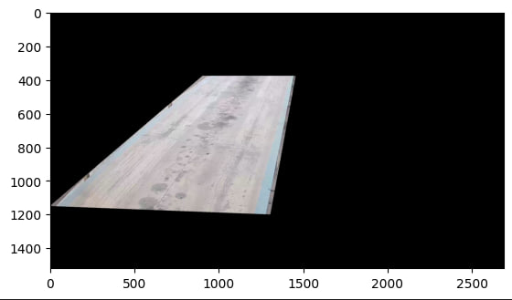

# Simple Sample Cropping Area From Image

We need python3 with installed matplotlib, numpy and cv2

## Install dependencies:
```py
pip install matplotlib
pip install numpy
pip install opencv-python
```
## Create file and write code:
```py
import  cv2
import  numpy as np
from    matplotlib import pyplot as plt

frame   = cv2.imread('frame.png')
pts     = np.array([[0, 1150], [900, 380], [1450, 380], [1300, 1200]])
# pts     = np.array([[0, 1500], [0, 1000], [600, 500], [1400, 500], [1400, 1500]])
mask    = np.zeros(frame.shape[:2], np.uint8)
cv2.drawContours(mask, [pts], -1, (255, 255, 255), -1, cv2.LINE_AA)
end_frame = cv2.bitwise_and(frame, frame, mask=mask)


plt.imshow(fr_end)
plt.show()
plt.imshow(frame)
plt.show()


```

## We get result like this



